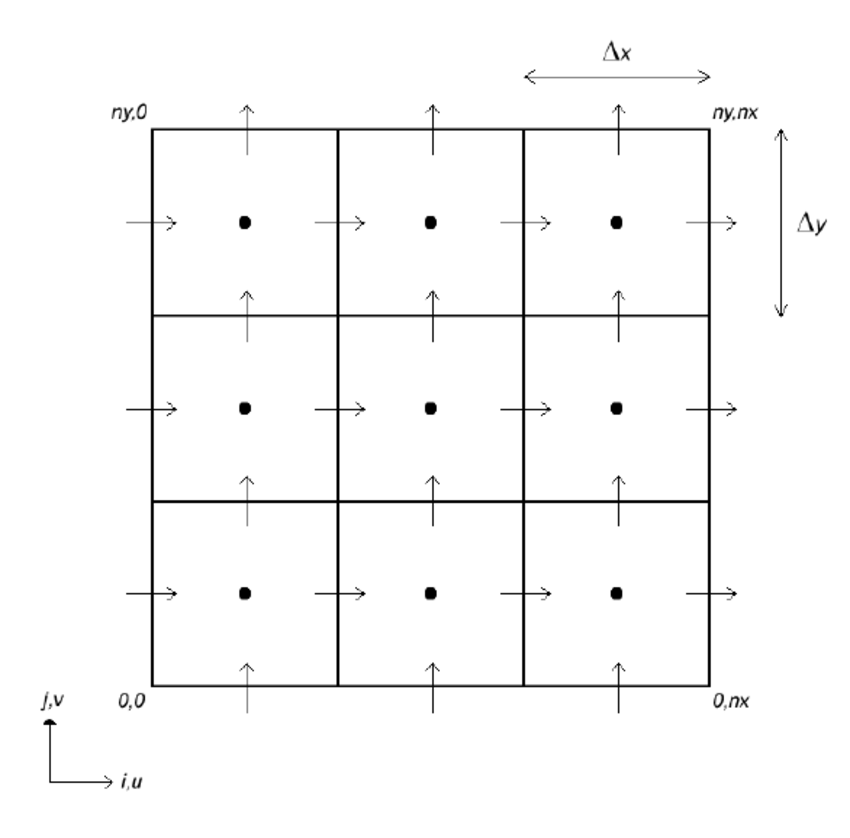
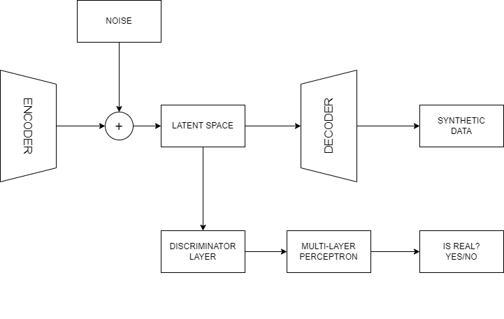
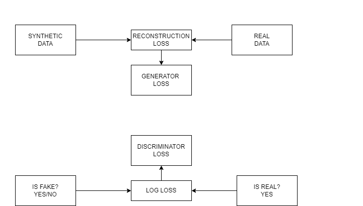
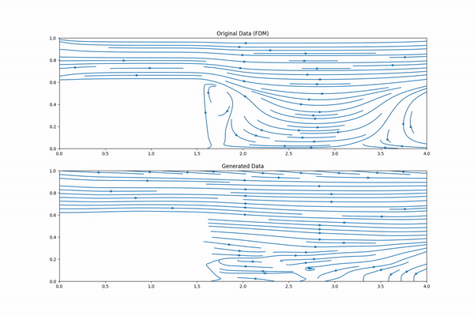

# Semi-compressed pipe flow pattern prediction based on Adversarial Autoencoder
Final Project for physics undergraduate degree based on Generative Adversarial Network Architecture using Tensorflow python Library that can imitate numerical data generated from Navier-Stokes solution solved by Numerical Method and staggered-grid model.

### Navier-Stokes
Navier-stokes equation is partial differential equations which describe the motion of viscous fluid substances. The Navier-stokes equation express momentum balance for newtonian fluids and make use of conservation of mass.
$$ \rho \left ( \frac{\partial \vec{v}}{\partial x} + \vec{v}\cdot \triangledown  \vec{v} \right ) = - \triangledown p+\rho \vec{F} + \mu \triangledown ^{2}\vec{v}$$
where $\rho$ is fluid density, $\vec{v}$ is velocity of fluid, $p$ is pressure, $\vec{F}$ is external force, and $\mu $ is kinematic viscosity.

### Staggered-grid model

 
Staggered grid model is a form of discretization through the formation of grids in the fluid motion space and stores the pressure and velocity components of the fluid separately. This separation aims to avoid oscillations between pressure and velocity when calculating with numerical methods (Blazek, 2015; Sharma, 2017).

### Model Architecture

 
Autoencoder Architecture combined with Adversarial framework are used for generating synthetic data. For this scenario Autoencoder act as generator. The autoencoder consist of Encoder, Latent space, and decoder. Meanwhile, for adversarial framework comparison step work by compare image from the latent space with real image (Training image).
 

 
Model Weight tuning (Backpropagation) happen based on two losses, namely reconstruction loss for generator and log loss for discriminator loss. those losses are obtained from the training phase. The training phase have 2 phase, that run sequentially through training processes. 
* The first phase is to train generator by comparing the generated data by generator with real image (Train data). This checking phase is carried out by discriminator. 
* The second phase goal is to train the discriminator to be able to distinguish betweeen the real image and the fake image (Generated data by generator).

## :wrench: Requirement (Tested on)
Python Version 3.8.10
| Depedencies  | Version | Description |
| ------------- | ------------- |  -------------  |
| Matplotlib  | 3.7.4  | Visualizing the result with graph  |
| Numpy  | 1.24.3  | Used for numerical calculation purpose  |
| Pandas  |2.0.3 | Mutating and manipulating dataset  |
| Pillow  | 10.1.0  | Picture file generating or manipulating picture related  |
| Tensorflow  | 2.13.0 | Back-end computation tools for model training  |
| Keras  | 2.13.1  | Deep learning Framework for creating Model  |
| Cuda  | 11.8  | Improve model training speed by using GPU utility training  |

## :file_folder: File Description

| Filename  | Description |
| ------------- | ------------- | 
| `main.py`  | Main Program file to initiate the program |
| `config.py`  | File for defining constant value for calculating, training, and dataset shape  |
| `custom.py`  | Custom training function file for model training purpose |
| `data_generator.py`  | Generating numerical dataset of Navier-stokes solution and convert to csv or picture  |
| `gan_module.py`  | Generative Adversarial Network (GANs) model Architecture and model training |
| `utils.py`  | Utility functions |

## :pushpin: Dataset and Model Weight
### Dataset [:globe_with_meridians:](https://drive.google.com/drive/folders/1ItIHJcdPWXIA1-xKdYyM3NiVqae_03ME?usp=sharing)
The dataset consist of dynamic solution for Navier-Stokes solution by numerical method and staggered-grid model with 16 timestep. The constant used for Navier-stokes variable value refer to `config.py`.

### Model Weight [:globe_with_meridians:](https://drive.google.com/drive/folders/14KPfD5oTiVvT_c-Q_hJh5jFBFfS_kYHL?usp=sharing)
The weight result of model training with 2 session of training (each 750 epochs). 
* **First run** is the first/initiation of training session and it's weight result used for next session. this training session run for 750 epochs
* **Second run** is the second training session, First run weight result used as it's initial weight. this training session run for 750 epochs

## Result Preview

 
The animation above is the solution of Navier-stokes equation by using Numerical Method. On the other hand, the bottom is generated data by Generative model that have been trained for 2 session training, each 750 epochs

## References

1. *Blazek, J. (2015). CFD Principles and Applications (3rd Editio). Elsevier Ltd.*
2. *Cai, S., Mao, Z., Wang, Z., Yin, M., & Karniadakis, G. E. (2021). Physics-informed neural networks (PINNs) for fluid mechanics: a review. Acta Mechanica Sinica/Lixue Xuebao, 37(12), 1727–1738. https://doi.org/10.1007/s10409-021-01148-1*
3. *Chen, D., Gao, X., Xu, C., Chen, S., Fang, J., Wang, Z., & Wang, Z. (2020). FlowGAN: A Conditional Generative Adversarial Network for Flow Prediction in Various Conditions. Proceedings - International Conference on Tools with Artificial Intelligence, ICTAI, 2020-Novem(November), 315–322. https://doi.org/10.1109/ICTAI50040.2020.00057*
4. *Eliyanto, J., & Hernadi, J. (2019). Pemodelan Persamaan Navier-Stokes untuk Aliran Fluida Tidak Termampatkan. Jurnal Ilmiah Matematika, 6(1), 22. https://doi.org/10.26555/konvergensi.v6i1.19545*
5. *Figueiredo, F. P., Martha, L. F., & Waltham, D. (2010). A Three-Dimensional Graphics Application for Numerical Simulations of Turbidity Currents in the Stratigraphic Modelling Process. XXXI Iberian-Latin-American Congress on Computational Methods in Engineering, January.*
6. *Fox, R. W., & Mitchell, J. W. (2020). Introduction of Fluid Mechanics. In Dynamics of Water Surface Flows and Waves (10th Editi). Wiley. https://doi.org/10.1201/9781003140160-1*
7. *Géron, A. (2019). Hands-on Machine Learning with Scikit-Learn, Keras & TensorFlow. O’Reilly Media, Inc. https://doi.org/978-1-492-03264-9
Ghojogh, B., Crowley, M., Karray, F., & Ghodsi, A. (2023). Advers*
9. *Ghojogh, B., Crowley, M., Karray, F., & Ghodsi, A. (2023). Adversarial Autoencoders. Elements of Dimensionality Reduction and Manifold Learning, 577–596. https://doi.org/10.1007/978-3-031-10602-6_21*
10. *Goodfellow, I., Pouget-Abadie, J., Mirza, M., Xu, B., Warde-Farley, D., Ozair, S., Courville, A., & Bengio, Y. (2020). Generative adversarial networks. Communications of the ACM, 63(11), 139–144. https://doi.org/10.1145/3422622*
11. *Jalaluddin, S. A., & Ishak, N. Z. (2019). Analisa Profil Aliran Fluida Cair dan Pressure Drop pada Pipa L menggunakan Metode Simulasi Computational Fluid Dynamic (CFD). Jurnal Teknologi Kimia Unimal, 4(2), 20--30.*
12. *Kong, Q., Siauw, T., & Bayen, A. M. (2020). Python Programming and Numerical Methods. A Guide for Engineers and Scientists. In Python Programming and Numerical Methods.*
13. *Martanegara, H. A., & Yulianti, K. (2020). Model Matematika Fluida Lapisan Tipis Pada Bidang Miring. Jurnal EurekaMatika, 8(1), 29–41.*
14. *Munson, B. R., Young, D. F., & Okiishi, T. H. (2013). Fundamentals of fluid mechanics (Seventh Ed). John Wiley & Sons, Inc. https://doi.org/10.1201/b11709-7*
15. *Raissi, M., Perdikaris, P., & Karniadakis, G. E. (2017). Physics Informed Deep Learning (Part II): Data-driven Discovery of Nonlinear Partial Differential Equations. December. http://arxiv.org/abs/1711.10566*
16. *Sharma, A. (2017). Introduction to Computational Fluid Dynamics. In Strojniski Vestnik/Journal of Mechanical Engineering (Vol. 39, Issues 5–8). John Wiley & Sons, Inc.*
17. *Shi, X., Chen, Z., Wang, H., Yeung, D. Y., Wong, W. K., & Woo, W. C. (2015). Convolutional LSTM network: A machine learning approach for precipitation nowcasting. Advances in Neural Information Processing Systems, 2015-Janua, 802–810.*
18. *Strikwerda, J. C. (2004). Finite Difference Schemes and Partial Differential Equations (2nd Editio). Society for Industrial and Applied Mathematics Philadelphia.*
19. *Tian, Y., Su, D., Lauria, S., & Liu, X. (2022). Recent advances on loss functions in deep learning for computer vision. Neurocomputing, 497, 129–158. https://doi.org/10.1016/j.neucom.2022.04.127*
20. *Tran, D., Bourdev, L., Fergus, R., Torresani, L., & Paluri, M. (2015). Learning spatiotemporal features with 3D convolutional networks. Proceedings of the IEEE International Conference on Computer Vision, 2015 Inter, 4489–4497. https://doi.org/10.1109/ICCV.2015.510*
21. *Vint, D., Anderson, M., Yang, Y., Ilioudis, C., Di Caterina, G., & Clemente, C. (2021). Automatic target recognition for low resolution foliage penetrating sar images using cnns and gans. Remote Sensing, 13(4), 1–18. https://doi.org/10.3390/rs13040596*
22. *Xu, B., Wang, N., Chen, T., & Li, M. (2015). Empirical Evaluation of Rectified Activations in Convolutional Network. http://arxiv.org/abs/1505.00853*
23. *Yalgin, G., Zarepakzad, N., Artun, E., Durgut, I., & Kok, M. V. (2018). Design and development of data-driven screening tools for enhanced oil recovery processes. SPE Western Regional Meeting Proceedings, 2018-April(September). https://doi.org/10.2118/190028-ms*

